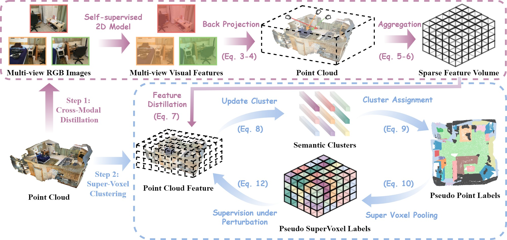

[](https://arxiv.org/abs/2304.08965)
[](https://creativecommons.org/licenses/by-nc-sa/4.0/legalcode)

## PointDC:Unsupervised Semantic Segmentation of 3D Point Clouds via Cross-modal Distillation and Super-Voxel Clustering (ICCV 2023)

### Overview

We propose an unsupervised point clouds semantic segmentation framework, called  **PointDC**.

<p align="center">

</p>

## NOTE
There are two projects deployed here. [pointdc_mk](https://github.com/SCUT-BIP-Lab/PointDC/tree/main/pointdc_mk) is based on [MinkowskiEngine](https://github.com/NVIDIA/MinkowskiEngine).

## TODO
- [x] Release code based on Minkowski and model weight files
- [ ] Release code based on SpConv and model weight files
- [x] Release Spare Feature Volume files


### Citation
If this paper is helpful to you, please cite:
```
@article{chen2023unsupervised,
  title={Unsupervised Semantic Segmentation of 3D Point Clouds via Cross-modal Distillation and Super-Voxel Clustering},
  author={Chen, Zisheng and Xu, Hongbin},
  journal={arXiv preprint arXiv:2304.08965},
  year={2023}
}
```